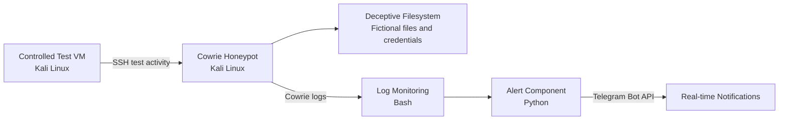
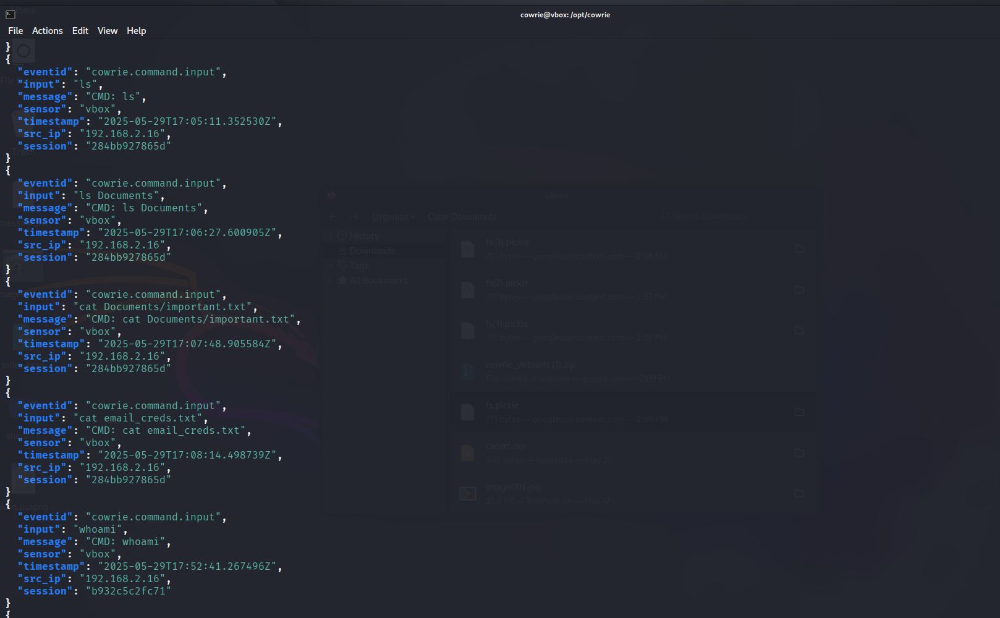
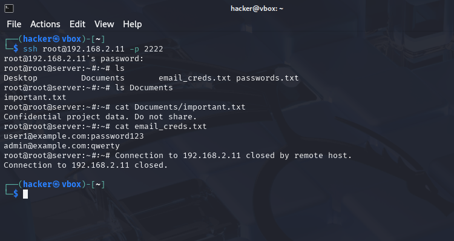
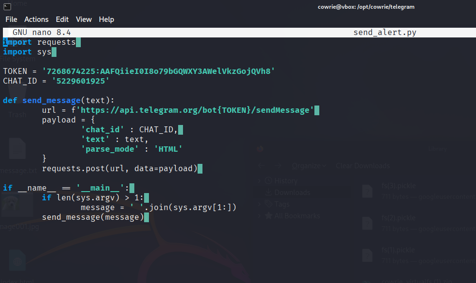
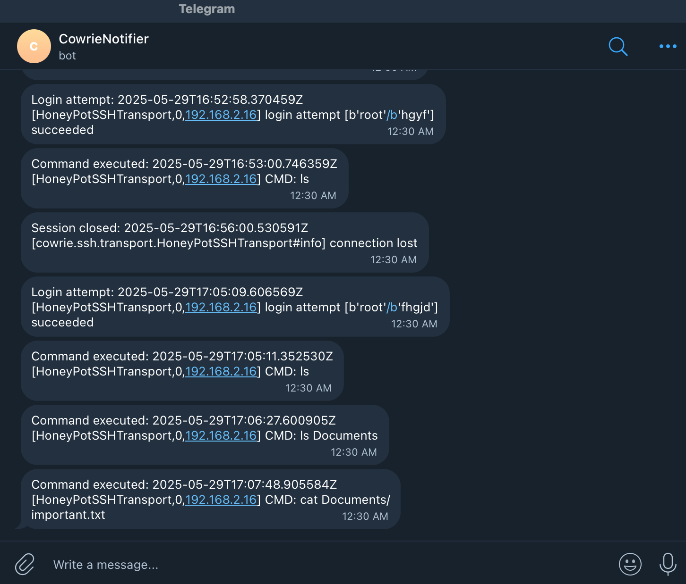

# Adaptive Honeypot System

**Bachelor's Thesis Project — BSc Cybersecurity and Networks, 2025**

A controlled cybersecurity research project built around the Cowrie SSH/Telnet honeypot, combining a deceptive filesystem, human-like interaction concepts, attack telemetry analysis, and real-time Telegram alerts.

> **Portfolio note:** This repository is a sanitized reconstruction of the completed academic project. The implementation and experiments described below come from the original dissertation. Public sample data, configuration templates, and documentation have been cleaned or reconstructed to remove credentials and personal identifiers.

## Research Goal

The project investigated whether a more realistic, human-like honeypot environment could encourage attacker interaction and provide richer telemetry for security analysis.

A controlled virtual lab was created with two Kali Linux virtual machines: one hosting the customized Cowrie honeypot and one generating controlled test activity. The environment combined deception, event logging, log analysis, automated monitoring, and real-time notifications.

## What Was Implemented

- Cowrie SSH/Telnet honeypot in a controlled Kali Linux environment
- Customized deceptive filesystem containing fictional files and credentials
- Human-like and scripted interaction elements intended to improve realism
- Capture and analysis of authentication, command, session, and download activity
- Python integration with the Telegram Bot API for real-time alerts
- Bash-based Cowrie log monitoring
- systemd service for automatic monitoring startup
- JSON event inspection and filtering with `jq`
- Controlled evaluation using login attempts, command execution, deceptive-file access, and file retrieval

## System Architecture



The diagram reflects the controlled lab workflow used in the academic project: test activity reached Cowrie over SSH, Cowrie recorded the interaction, the monitoring component watched relevant log activity, and the Python component sent notifications through Telegram.

## Controlled Evaluation

The academic evaluation covered several observable behaviours within the lab environment:

| Scenario | Evidence captured |
| --- | --- |
| Authentication attempts | Failed and successful login events |
| Shell interaction | Commands recorded as Cowrie command-input events |
| Deceptive file access | Interaction with intentionally placed fictional files and credentials |
| File retrieval | Controlled download activity recorded by the honeypot |
| Monitoring | Relevant Cowrie activity detected by the log-monitoring component |
| Alerting | Telegram notifications generated from monitored events |

The project explored the effect of human-like and deceptive elements on honeypot interaction. This portfolio version intentionally describes that as the research objective rather than presenting a stronger quantitative claim than the documented experiments support.

## Documentation

- [Project Notes](docs/PROJECT_NOTES.md) — implementation and design summary
- [Lab Setup Overview](docs/SETUP_OVERVIEW.md) — controlled environment and project components
- [Testing and Results](docs/TESTING_AND_RESULTS.md) — documented test scenarios and evidence
- [Security and Sanitization](docs/SECURITY.md) — rules used for the public portfolio reconstruction
 
## Demonstration

The following screenshots were captured during the controlled evaluation of the original Bachelor's thesis project.

### Successful Authentication Recorded by Cowrie

<p align="center">
  
</p>

---

### Command Activity Captured by the Honeypot

<p align="center">
  
</p>

---

### Controlled Download Activity (`wget`)

<p align="center">
  
</p>

---

### Real-time Telegram Alerts

<p align="center">
  
</p>

## Public Examples

The repository contains sanitized examples representing the kinds of artifacts used in the project:

- `samples/sanitized_cowrie_event.json` — authentication-event example
- `samples/sanitized_command_event.json` — command-input example
- `samples/sanitized_download_event.json` — controlled download-command example
- `honeypot/example_fake_files/` — reconstructed fictional files representing the deceptive filesystem concept
- `.env.example` — placeholder-only Telegram configuration template

These public examples are not presented as untouched original experiment data. Raw logs, original secrets, and identifying information are intentionally excluded.

## Repository Structure

```text
adaptive-honeypot-system/
├── README.md
├── .gitignore
├── .env.example
├── src/
│   └── send_alerts.py
├── systemd/
│   └── watchlog.service
├── honeypot/
│   └── example_fake_files/
│       ├── email_cred.txt
│       └── important.txt
├── samples/
│   ├── sanitized_cowrie_event.json
│   ├── sanitized_command_event.json
│   └── sanitized_download_event.json
└── docs/
    ├── PROJECT_NOTES.md
    ├── SETUP_OVERVIEW.md
    ├── TESTING_AND_RESULTS.md
    └── SECURITY.md
```

## Security & Privacy

The public repository excludes real API tokens, Telegram chat identifiers, personal identifiers, unsanitized logs, and real credentials. Original screenshots are not published as-is when they expose unnecessary raw data or credentials.

The alerting example reads Telegram configuration from environment variables rather than embedding secrets in source code.

## Technologies

`Python` · `Bash` · `Cowrie` · `Kali Linux` · `Linux` · `systemd` · `Telegram Bot API` · `JSON` · `jq` · `VirtualBox`

## Project Status

**Academic project:** completed in 2025  
**Public repository:** sanitized portfolio reconstruction

The repository preserves the technical design, implementation concepts, and controlled evaluation of the original project while keeping sensitive academic and operational information out of the public version.
